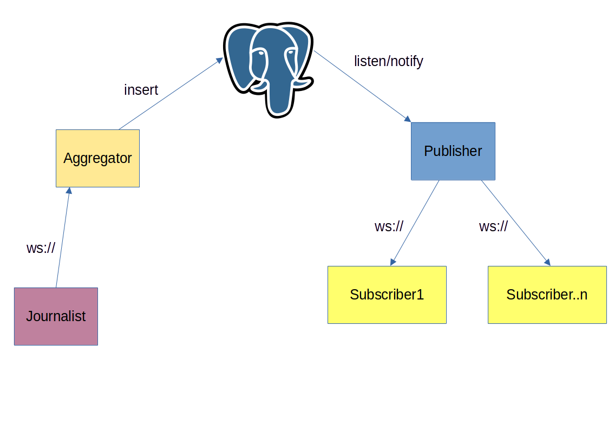

# Y, a golang publish-subscribe platform using websockets and Postgres as message queue!



## How to build, test and run

Having `make` command installed is a prerequisite.

- Building:

    ```make services```

- Running tests:

    ```make test```

- Test coverage (will open a tab in the browser):

    ```make coverage```

- Run project:

    ```make run```

For both, running the tests as well as checking the test coverage, make sure you have the database running.
You can do that by spinning up all the project with `make run` or just the database with `docker compose up db`

## Usage

### Spinning up

First spin up the project with ```make run```

### Adding subscribers

Then you can start adding subscribers. For that, switch to `subscriber` directory and run 
```
go run . -addr="localhost:8081" -user-id="a48bd304-7101-47e7-95ed-087b9b3a7f8d"
```
You can add multiple subscribers, each on a new terminal session. If you try to subscribe twice the same subscriber ID you'll get an error (Try it out : ) )

### Publishing messages

To publish messages switch to `journalist` directory in a new terminal and run 
```
go run . -addr="localhost:8080"
````
You can automate the process of publishing messages running the binary setting the auto flag to true:
```
go run . -addr="localhost:8080" -auto=true
```
